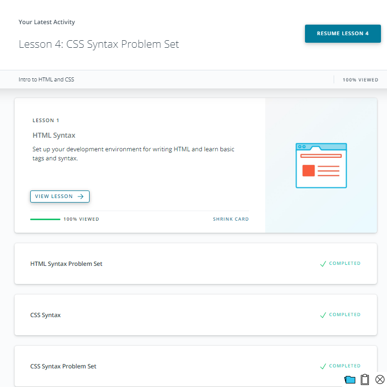
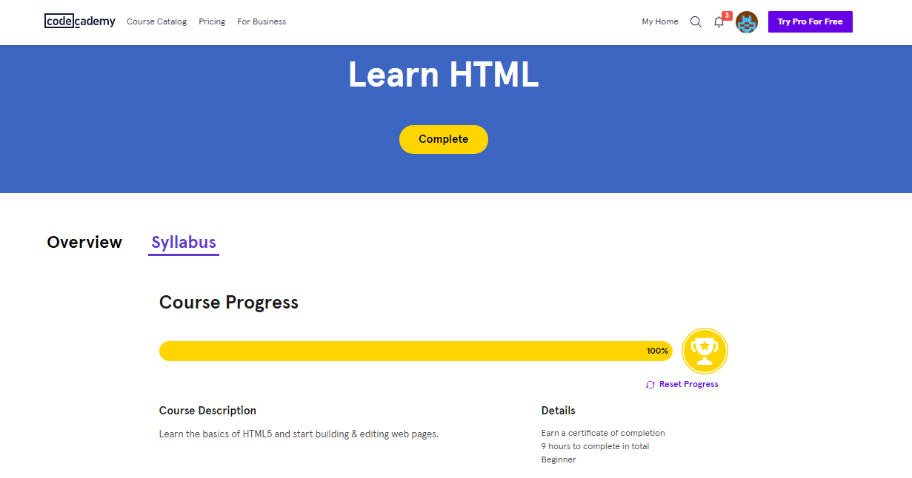

# kottans-frontend

## Tasks Listing

## 1. Git intro

  Git really great technologie. Is is simple, strong and safely. Simple thingth, that don't need to add something, are very fundamental and convenient.
  Great that git is so powerful and laconic. Basic abstractions of git are:
  - repository
  - branch
  - commit
  - HEAD (commit in focus)
  - remote repository
  - tag
  

 There are not so many commands in git like in programming languages. This not suprising because there is a lot more abstraction in programming languages.
 
 Commands thet I learned in course and practice in [learngitbranching.js.org](https://learngitbranching.js.org/?locale=ru_RU "Great App")
 
  - add
  - commit (--amend)
  - log (--stat, -p, --oneline, --decorate, --graph, --all)
  - show
  - diff
  - checkout (-b)
  - branch (-D, -f, -m, -u)
  - revert
  - reset
  - rebase (-i)
  - cherry-pick
  - fetch
  - merge
  - pull (fetch+merge)
  - clone
  - push
  
Thanks for this knowledge.  It was fun.

  
## 2. Linux CLI, HTTP

Linux is free OS. That's why it is convenient use Linux on servers. Main features of Linux are:
  - all-powerfull command line
  - modularity
  - customizability
  
You can make everything with help of command line: create and delete files, rename it, kill process and redirect stdout in another program.
It was interesting. I fill like hacker. I made many things only with help of keyboard and terminal.

Thanks.

   
## 3. Git for Team Collaboration

  This task was like first. I learned some new commands, but it still Git.
  
  Thanks.
  
  
  
  

  
  
## 4. Front-End Basics
  HTML is the language which tell the browser how it should to display site or app. CSS helps HTML and make site or app perfect with help of more specialized features.
  
  
  
  
## 5. Responsive Layouts

  Responsive Desing is very import part of frontend devrlopment. Our app must be beautiful and useful when it use from any size of display. It can be phone or desctop.
  Flex-box - useful and handy.
  
  

  
  
## 6. HTML & CSS Practice - practice

[Demo](https://roophee.github.io/) -- 
This task was interesting for me. It was like a challenge. Theoretical knowledge only in practice becomes an understanding and an effective force. Thanks for this experience!

## 7. JavaScript Basics

Javascript is interesting and powerful instrument, that helps make web-pages more dynamic.

Other screens are in folder.

## 8. Document Object Model - practice

[Demo](https://roophee.github.io/js1/)

DOM API is a great thing. With help of it you can interact with almost any part of Web-page. JS & DOM API powerfull duet. Thants!

## 9 Building a Tiny JS World (pre-OOP) - practice

[Demo](https://roophee.github.io/js-tyni-world-noOOP/) | 
[Code base](https://github.com/Roophee/frontend-2021-homeworks/tree/a-tyni-js-world-2/submissions/Roophee/a-tyni-js-world-roophee)

This task was a new experience for me. I have some skills in Python, and it's help me.  But basic knowledge for pass this task are Array`s methods. Array object have few methods, that help manipulate with array items in one or two commands. It's very useful.

## 10. Object-Oriented JavaScript - practice
## 11. OOP exercise - practice
## 12. Offline Web Applications - optional
## 13. Memory – Pair Game - practice
## 14. Website Performance Optimization - optional
## 15. Friends App - practice
